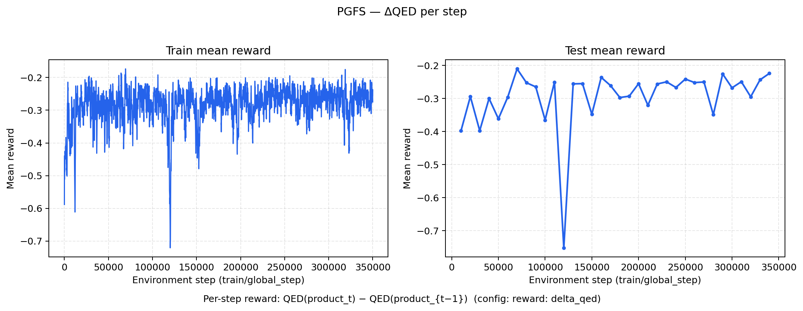
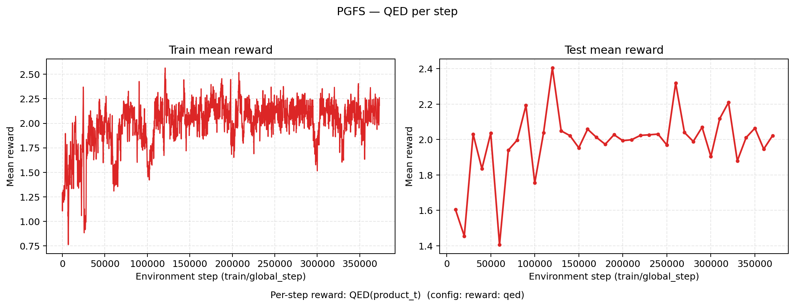

# PGFS —  Policy Gradient for Forward Synthesis

Standalone reproduction of **Policy Gradient for Forward Synthesis (PGFS)** from the paper:

> **Learning to Navigate the Synthetically Accessible Chemical Space Using Reinforcement Learning**  
> Sai et al., 2020 — [arXiv:2004.12485](https://arxiv.org/pdf/2004.12485)

This repo implements the **bimolecular** setup from §4.3, Algorithm 1, and Figure 2 of that paper.

Both shipped configs use the **same paper-style setup** (ECFP state, RLV2 action, kNN k=1, `r2_available` masking, no Stop, horizon 5). They differ only in the **per-step reward signal** — see [Reward modes](#reward-modes) below.

---

## Workflow

### 1. Install

```bash
git clone https://github.com/bz317/PGFS.git PGFS
cd PGFS

# One-shot conda env (PyTorch + CUDA 12.1, RDKit, FAISS-GPU, …)
conda env create -f env.yml
conda activate pgfs

# Install this package in editable mode
pip install -e .
```

**Smoke test** (no W&B account needed):

```bash
WANDB_MODE=offline python scripts/train.py \
  --config configs/paper_style_delta_qed.yaml \
  --total-timesteps 5000
```

**CPU-only:** edit `env.yml` — drop `pytorch-cuda=12.1`, replace `faiss-gpu` with `faiss-cpu`, then recreate the env.

**Optional:** log in to Weights & Biases for online metrics (`wandb login`).

### 2. Run

**Local training** (default: **ΔQED per step**, paper §4.3 hyperparameters, 1M env steps):

```bash
conda activate pgfs
cd PGFS
python scripts/train.py --config configs/paper_style_delta_qed.yaml
```

**Reward variants** (identical architecture / hyperparameters; only `reward` in the YAML changes):

```bash
# (1) ΔQED per step — default, recommended for molecule improvement
python scripts/train.py --config configs/paper_style_delta_qed.yaml

# (2) QED per step — absolute QED of each product (dense, paper-style horizon)
python scripts/train.py --config configs/paper_style_qed.yaml
```

Other launch options:

```bash
# Wrapper script (activates conda, sets PYTHONPATH)
bash run_launcher/run_train.sh

# HPC (SLURM, 1× GPU, 36 h) — default config is paper_style_delta_qed.yaml
sbatch run_launcher/HPC/slurm_gpu_paper_style

# Absolute-QED reward on SLURM
CONFIG=configs/paper_style_qed.yaml sbatch run_launcher/HPC/slurm_gpu_paper_style
```

**Resume** from a checkpoint:

```bash
python scripts/train.py --config configs/paper_style_delta_qed.yaml \
  --resume-checkpoint runs/<run_id>/td3_checkpoints/checkpoint_100000.tar \
  --run-id <run_id>
```

### 3. Results

Training creates three output locations under the repo root:

```text
PGFS/
├── runs/
│   └── <wandb_run_id>/              # one directory per training run
│       └── td3_checkpoints/
│           ├── checkpoint_100000.tar   # periodic saves (model_save_freq)
│           ├── checkpoint_200000.tar
│           └── final_model.pth         # written at end of training
├── wandb/                           # local W&B sync (if WANDB_MODE=online)
│   └── run-<timestamp>-<id>/
│       ├── files/config.yaml
│       └── logs/
└── logs/                            # SLURM / launcher tee logs
    └── pgfs_paper_style_<jobid>.log
```

**Checkpoints** (`*.tar` / `final_model.pth`) contain actor + critic weights, optimizer state, training step count, and (optionally) replay buffer.

**W&B metrics** (when online) include:

| Namespace | Examples |
|-----------|----------|
| `train/` | `mean_reward`, `global_step`, `critic_loss`, `actor_loss`, `temperature` |
| `eval/` | `mean_reward` (test pool return), `mean_final_delta_qed`, `mean_final_qed`, `mean_ep_length`, `max_qed`, `n_molecules` |

Primary molecule-quality metric: **`eval/mean_final_delta_qed`** (mean QED improvement over the held-out test reactant pool).

---

## Reward modes

| Mode | Config key | Per-step reward | Config file |
|------|------------|-----------------|-------------|
| **(1) ΔQED per step** | `reward: delta_qed` | `QED(product_t) − QED(product_{t−1})` — rewards *improvement* at each reaction | `configs/paper_style_delta_qed.yaml` |
| **(2) QED per step** | `reward: qed` | `QED(product_t)` — rewards *absolute* drug-likeness of each intermediate/final product | `configs/paper_style_qed.yaml` |

Override from the CLI: `--reward delta_qed` or `--reward qed`.

---

## Training curves

Example **paper-style** runs on the Bi setup (same architecture / hyperparameters as the configs above; logged on [Weights & Biases](https://wandb.ai/boqiaoz-cambridge/GenMolRL_Bi)). Each panel shows **`train/mean_reward`** and **`test/mean_reward`** for one reward mode — the latter is W&B’s `eval/mean_reward` (mean episodic return on the held-out test reactant pool). X-axis is **`train/global_step`** (same as the W&B UI).

| Run | W&B | Reward (per step) | Steps (snapshot) | Train mean reward | Test mean reward |
|-----|-----|-------------------|------------------|-------------------|------------------|
| **ΔQED** | [`6ryqkars`](https://wandb.ai/boqiaoz-cambridge/GenMolRL_Bi/runs/6ryqkars) | `QED(product_t) − QED(product_{t−1})` | ~350k / 1M | ≈ −0.27 | ≈ −0.22 |
| **QED** | [`3d7j4vp2`](https://wandb.ai/boqiaoz-cambridge/GenMolRL_Bi/runs/3d7j4vp2) | `QED(product_t)` | ~373k / 1M | ≈ 2.20 | ≈ 2.02 |

**ΔQED per step** (`reward: delta_qed`):



**QED per step** (`reward: qed`):



**How to read these plots**

- **ΔQED per step** — mean reward is the average *improvement* at each reaction; values are typically small and can be negative when most steps do not increase QED.
- **QED per step** — mean reward is the average *absolute* QED of products along the trajectory; values are positive (~0.3–0.9 per step) and episode return sums over up to 5 reactions.
- **Train vs test** — training rollouts sample random building-block starts; test rollouts cycle held-out test reactants. The two reward modes use different scales, so compare train vs test within each panel rather than across panels.
- **Molecule quality** — for both runs, use **`eval/mean_final_delta_qed`** (endpoint ΔQED), not `mean_reward`, to judge whether molecules actually improved.

Regenerate from W&B (requires `wandb login` or `WANDB_API_KEY`):

```bash
python scripts/plot_wandb_curves.py   # writes figures/pgfs_*.png and *.csv
```

The script fetches **train** and **test** metrics separately (W&B merges sparse series incorrectly if requested in one call) and uses `train/global_step` as the x-axis. Train curves are downsampled to 5k points; test curves are logged every eval (≈10k steps) and shown with markers. W&B’s UI may apply additional smoothing on `train/mean_reward`.

---

## What this implements

PGFS learns a policy over **reaction templates** and **second reactants** (building blocks) under synthesis constraints:

- **State** \(R^{(1)}\): Morgan ECFP fingerprint (1024-d)
- **Action** \(R^{(2)}\): continuous RLV2 descriptor (35-d MolDSet) retrieved via **kNN** (k=1) with **product-reward** scoring (forward-react each candidate, argmax using the active reward mode)
- **Template head** `f`: FC[256,128,128] + tanh, trained with auxiliary cross-entropy (coef=1.0)
- **Policy** `π`: FC[256,256,167] + tanh → RLV2 vector
- **Critic** `Q`: twin networks FC[256,64,16] (TD3, as in the paper)
- **Optimizer**: Adam, lr 1e-4 (actor), 3e-4 (critic)
- **Masking**: `r2_available` (state-dependent template + R2 feasibility)
- **No Stop action** (paper-style; fixed horizon = 5 reactions)
- **Training starts**: random draw from building-block pool
- **Evaluation**: cycle through held-out test reactants; R2 pool from training set (`eval_r2_pool: train`)
- **Reward**: per-step ΔQED or per-step QED — see [Reward modes](#reward-modes)

### Difference from the original paper

1. **Eval protocol**: full test reactant pool (~12k molecules) one-by-one eval.


---

## Repository layout

```text
PGFS/
├── env.yml                # conda environment (recommended install path)
├── pyproject.toml         # pip install -e .
├── requirements.txt       # pip-only fallback
├── pgfs/                  # Python package (env, TD3 agent, kNN, chem)
├── configs/               # paper_style_delta_qed.yaml, paper_style_qed.yaml
├── data/Bi/               # bundled reactants + templates (~11 MB)
├── scripts/train.py       # CLI entry point
├── scripts/plot_wandb_curves.py  # regenerate README training curves from W&B
├── figures/               # training curve PNGs + CSV exports (for README)
├── run_launcher/          # run_train.sh + HPC/slurm_gpu_paper_style
├── runs/                  # checkpoints (created at train time)
├── wandb/                 # W&B local files (created at train time)
└── logs/                  # SLURM logs (created at submit time)
```

### Bundled data (`data/Bi/`)

| File | Description |
|------|-------------|
| `reactants_train.pkl` | Training building blocks (R2 pool + training starts) |
| `reactants_test.pkl` | Held-out test reactants (eval R1 cycle) |
| `templates.pkl` | Reaction templates (uni + bi) |
| `reactants_train.pkl.rlv2_norm.npz` | Pre-fit RLV2 normalisation stats |

Pickle schema: `{smiles: descriptor_array}` for reactants; `{id: template_dict}` for templates.

---

## Installation details

### Option A — conda (recommended)

```bash
conda env create -f env.yml
conda activate pgfs
pip install -e .
```

Update an existing environment:

```bash
conda env update -n pgfs -f env.yml --prune
```

### Option B — pip only

If you already have PyTorch, RDKit, and FAISS:

```bash
pip install -r requirements.txt
pip install -e .
```

| Package | Role |
|---------|------|
| PyTorch | TD3 actor / critic |
| RDKit | Reactions, QED, Morgan FP, RLV2 descriptors |
| FAISS | kNN over R(2) building-block keys |
| Gymnasium | Environment API |
| PyYAML | Config loading |
| Weights & Biases | Metrics + run tracking |


---

## Reference

**Learning to Navigate the Synthetically Accessible Chemical Space Using Reinforcement Learning**  
Sai et al., 2020 — [arXiv:2004.12485](https://arxiv.org/pdf/2004.12485) (PGFS)

---

## License

See LICENSE (if present) or the parent GenMolRL repository license.
